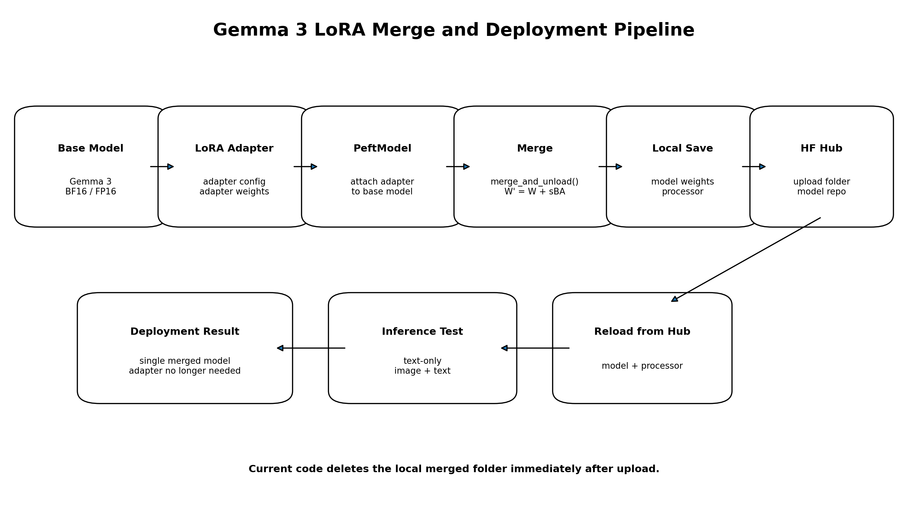
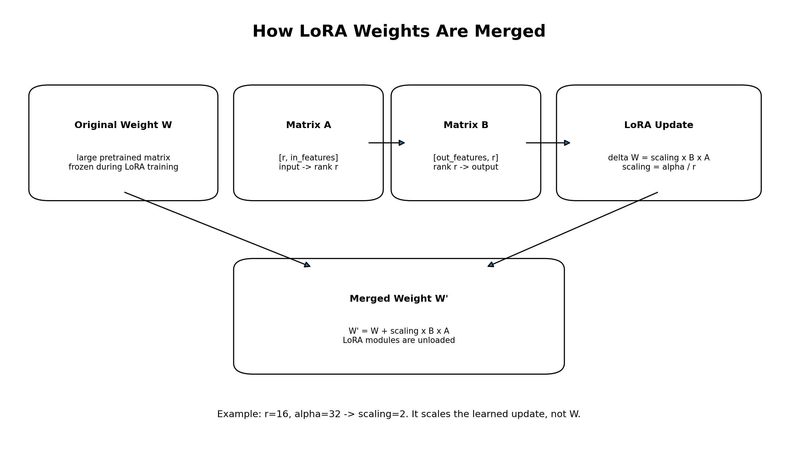
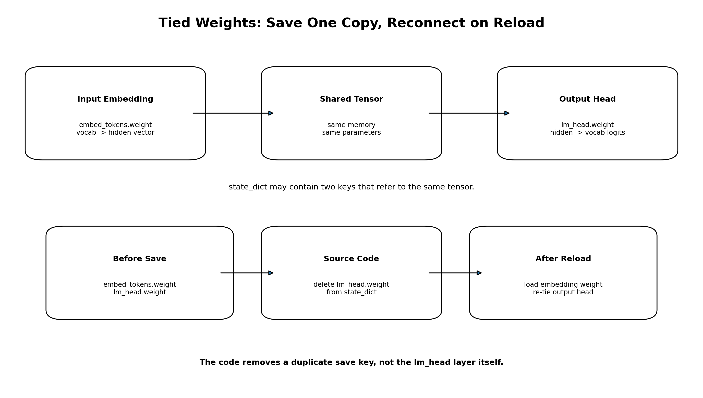

# Gemma 3 LoRA 어댑터 병합·저장·배포

`03. 데이터병합 및 저장_멀티모달데이터_Gemma3.py`는 이전 단계에서 학습한 **LoRA 어댑터를 Gemma 3 베이스 모델에 병합**하고, 병합된 모델과 Processor를 로컬에 저장한 뒤 Hugging Face Hub에 업로드하고 실제 추론까지 검증하는 스크립트입니다.

학습 단계에서는 보통 베이스 모델 전체가 아니라 LoRA 어댑터만 저장됩니다.

```text
adapter_config.json
adapter_model.safetensors
```

이 상태에서는 추론할 때마다 다음 두 요소가 필요합니다.

```text
Gemma 3 베이스 모델
+
LoRA 어댑터
```

현재 스크립트는 둘을 하나의 모델로 병합합니다.

```text
Gemma 3 베이스 모델
+
학습된 LoRA 어댑터
    ↓
병합된 Gemma 3 모델
```



---

## 1. 주요 기능

- `.env`에서 병합·배포 설정 로드
- Hugging Face 로그인
- Gemma 3 베이스 모델을 BF16 또는 FP16으로 로드
- 학습된 LoRA 어댑터를 베이스 모델에 연결
- `merge_and_unload()`로 LoRA 가중치 병합
- 양자화 잔재 여부 검사
- tied weight 중복 키 제거
- 병합 모델과 Processor 로컬 저장
- Hugging Face Hub 업로드
- Hub에서 병합 모델 재로드
- 텍스트 전용 추론 검증
- 이미지+텍스트 추론 검증

---

## 2. 실행 방법

```bash
python "03. 데이터병합 및 저장_멀티모달데이터_Gemma3.py"
```

원본 파일명이 별표를 포함한다면 다음처럼 실행합니다.

```bash
python "★03. 데이터병합 및 저장_멀티모달데이터_Gemma3.py"
```

---

## 3. 필요한 라이브러리

```bash
pip install torch transformers peft huggingface_hub python-dotenv pillow safetensors
```

---

## 4. 환경 변수 설정

스크립트와 같은 경로의 `.env` 파일에 다음 값을 설정합니다.

```env
HF_TOKEN=hf_xxxxxxxxxxxxxxxxx

BASE_MODEL=google/gemma-3-4b-it

ADAPTER_PATH=./models/gemma3_multimodal_lora_output

MERGED_LOCAL_DIR=./models/gemma3_multimodal_merged

MERGED_MODEL_REPO=YOUR_HF_ID/multi_modal_model_g3

TEST_IMAGE_PATH=./test/hundred.jpg
```

| 환경 변수 | 설명 |
|---|---|
| `HF_TOKEN` | Hugging Face 인증 토큰 |
| `BASE_MODEL` | LoRA 학습에 사용했던 원본 베이스 모델 |
| `ADAPTER_PATH` | 학습된 LoRA 어댑터 폴더 |
| `MERGED_LOCAL_DIR` | 병합 모델의 로컬 임시 저장 경로 |
| `MERGED_MODEL_REPO` | 업로드할 Hugging Face 모델 저장소 |
| `TEST_IMAGE_PATH` | 이미지 추론 검증용 파일 경로 |

> [!IMPORTANT]
> `BASE_MODEL`은 LoRA 학습 때 사용한 모델과 정확히 일치해야 합니다. 다른 베이스 모델에 어댑터를 연결하면 shape mismatch나 잘못된 출력이 발생할 수 있습니다.

---

## 5. 전체 실행 순서

```text
.env 설정 로드
    ↓
Hugging Face 로그인
    ↓
기존 로컬 병합 폴더 삭제
    ↓
Gemma 3 베이스 모델 로드
    ↓
Processor 로드
    ↓
LoRA 어댑터 연결
    ↓
merge_and_unload()
    ↓
양자화 잔재 검사
    ↓
tied weight 중복 키 제거
    ↓
병합 모델 로컬 저장
    ↓
Processor 로컬 저장
    ↓
Hugging Face Hub 업로드
    ↓
로컬 병합 폴더 삭제
    ↓
Hub에서 모델·Processor 재로드
    ↓
텍스트 추론
    ↓
이미지+텍스트 추론
```

---

## 6. 설정 로드: `loadConfig()`

```python
def loadConfig():
    scriptDir = os.path.dirname(os.path.abspath(__file__))

    load_dotenv(
        os.path.join(scriptDir, ".env"),
        override=True
    )

    cfg = {
        "hf_token": os.getenv("HF_TOKEN", "YOUR_HF_TOKEN"),
        "base_model": os.getenv(
            "BASE_MODEL",
            "google/gemma-3-4b-it"
        ),
        "adapter_path": os.getenv(
            "ADAPTER_PATH",
            "./models/gemma3_multimodal_lora_output"
        ),
        "merged_local_dir": os.getenv(
            "MERGED_LOCAL_DIR",
            "./models/gemma3_multimodal_merged"
        ),
        "merged_model_repo": os.getenv(
            "MERGED_MODEL_REPO",
            "YOUR_HF_ID/multi_modal_model_g3"
        ),
        "test_image_path": os.getenv(
            "TEST_IMAGE_PATH",
            ""
        ),
    }

    return cfg
```

스크립트와 같은 디렉터리의 `.env` 파일을 읽고 설정값을 딕셔너리로 반환합니다.

`override=True`이므로 운영체제에 이미 동일한 이름의 환경 변수가 있어도 `.env` 값이 우선 적용됩니다.

---

## 7. Hugging Face 로그인: `hfLogin()`

```python
def hfLogin(hfToken):
    if hfToken and hfToken not in (
        "YOUR_HF_TOKEN",
        ""
    ):
        login(hfToken)
```

유효한 토큰이 있으면 Hugging Face에 로그인합니다.

로그인 실패 시 즉시 종료하지 않고 경고만 출력합니다. 공개 모델 다운로드는 가능할 수 있지만 다음 작업에는 정상 토큰이 필요합니다.

```text
비공개 모델 접근
모델 저장소 생성
모델 업로드
비공개 저장소 재로드
```

---

## 8. 베이스 모델 로드: `loadBaseModel()`

### 8.1 dtype 결정

```python
if torch.cuda.get_device_capability()[0] >= 8:
    torchDtype = torch.bfloat16
else:
    torchDtype = torch.float16
```

GPU Compute Capability가 8 이상이면 BF16, 그보다 낮으면 FP16을 사용합니다.

```text
Ampere 이상 GPU → BF16
구형 CUDA GPU   → FP16
```

다만 현재 코드는 CUDA 사용 가능 여부를 먼저 검사하지 않으므로 CPU 환경에서는 오류가 발생할 수 있습니다.

안전한 형태는 다음과 같습니다.

```python
if torch.cuda.is_available():
    major, _ = torch.cuda.get_device_capability()

    if major >= 8:
        torchDtype = torch.bfloat16
    else:
        torchDtype = torch.float16
else:
    torchDtype = torch.float32
```

### 8.2 기존 병합 폴더 삭제

```python
if os.path.exists(mergedLocalDir):
    shutil.rmtree(mergedLocalDir)
```

이전 실행의 병합 파일이 현재 결과에 섞이지 않도록 기존 폴더를 삭제합니다.

### 8.3 양자화 없이 로드

```python
baseModel = AutoModelForImageTextToText.from_pretrained(
    cfg["base_model"],
    device_map="auto",
    torch_dtype=torchDtype,
    attn_implementation="eager",
    trust_remote_code=True,
    token=...
)
```

병합 작업에서는 `quantization_config`를 전달하지 않습니다.

LoRA 병합은 원래 가중치에 학습된 보정값을 직접 더하는 작업이므로, 베이스 가중치가 BF16 또는 FP16 같은 부동소수점 Tensor 형태인 것이 안전합니다.

```text
4비트 양자화 베이스 모델
→ 양자화 메타데이터 또는 특수 저장 구조 포함 가능
→ 병합·저장 후 재로드 오류 가능
```

```text
BF16/FP16 베이스 모델
→ 일반 부동소수점 가중치
→ LoRA 변화량 병합
→ 완전 모델 저장
```

---

## 9. Processor 로드

```python
processor = AutoProcessor.from_pretrained(
    cfg["base_model"],
    trust_remote_code=True,
    token=...
)
```

Processor에는 일반적으로 다음 요소가 포함됩니다.

```text
Tokenizer
Chat template
Image processor
특수 토큰 설정
이미지 리사이즈·정규화 설정
```

멀티모달 모델을 배포할 때 모델 가중치만 저장하고 Processor를 저장하지 않으면 학습 때와 다른 전처리가 적용될 수 있습니다.

---

## 10. LoRA 어댑터 병합

```python
def mergeAdapter(baseModel, adapterPath):
    peftModel = PeftModel.from_pretrained(
        baseModel,
        adapterPath
    )

    mergedModel = peftModel.merge_and_unload()

    return mergedModel
```

### 10.1 어댑터 연결

```python
peftModel = PeftModel.from_pretrained(
    baseModel,
    adapterPath
)
```

이 시점의 모델은 다음 구조입니다.

```text
베이스 가중치 W
+
LoRA 행렬 A, B
```

베이스 모델과 LoRA 어댑터는 아직 논리적으로 분리되어 있습니다.

### 10.2 `merge_and_unload()`

```python
mergedModel = peftModel.merge_and_unload()
```

LoRA 보정값을 원래 가중치에 더하고 LoRA 전용 모듈을 제거합니다.



병합 전 Linear layer 출력은 개념적으로 다음과 같습니다.

```text
출력 = W x + scaling × B A x
```

LoRA 변화량:

```text
ΔW = scaling × B A
```

병합 후 가중치:

```text
W' = W + scaling × B A
```

병합 후 출력:

```text
출력 = W' x
```

따라서 추론 시 LoRA 어댑터를 별도로 로드할 필요가 없습니다.

---

## 11. LoRA 행렬 `A`, `B`, `r`, `alpha`

원래 가중치가 다음 형태라고 하겠습니다.

```text
W: [out_features, in_features]
```

LoRA는 전체 크기의 변화량을 직접 학습하지 않고 두 개의 작은 행렬로 분해합니다.

```text
A: [r, in_features]
B: [out_features, r]
```

역할:

```text
A: 입력 특징을 rank r의 작은 공간으로 축소
B: rank r 특징을 다시 출력 차원으로 확대
```

예를 들어 학습 설정이 다음과 같다고 하겠습니다.

```python
r = 16
lora_alpha = 32
```

스케일은 다음과 같습니다.

```text
scaling = alpha / r
        = 32 / 16
        = 2
```

병합식:

```text
W' = W + 2 × B A
```

이는 원래 가중치 `W`를 2배 재학습했다는 뜻이 아닙니다. 학습된 LoRA 변화량 `BA`를 2배 스케일로 반영한다는 의미입니다.

간단한 수치 예:

```text
기존 가중치 효과 W = 1.00
학습된 BA 보정값   = 0.05
scaling            = 2
```

```text
W' = 1.00 + 2 × 0.05
   = 1.10
```

실제 모델에서는 `W`, `A`, `B`가 행렬이며 각 대상 Linear layer에서 행렬 연산으로 계산됩니다.

---

## 12. 병합 모델 저장: `saveMerged()`

```python
def saveMerged(
    mergedModel,
    processor,
    mergedLocalDir
):
```

이 함수는 다음 작업을 수행합니다.

```text
양자화 잔재 검사
→ 저장용 state_dict 생성
→ tied weight 중복 키 제거
→ 병합 모델 저장
→ Processor 저장
```

---

## 13. 양자화 잔재 검사

```python
for name, param in mergedModel.named_parameters():
    if (
        param.dtype in (
            torch.int8,
            torch.uint8
        )
        or (
            len(param.shape) == 1
            and param.shape[0] > 1_000_000
        )
    ):
        raise RuntimeError(...)
```

다음 조건을 양자화 잔재로 의심합니다.

```text
INT8 또는 UINT8 dtype
매우 큰 1차원 파라미터
```

이 검사는 잘못된 양자화 상태의 모델을 저장하지 않기 위한 예방 장치입니다.

다만 다음 조건은 휴리스틱입니다.

```python
len(param.shape) == 1
and param.shape[0] > 1_000_000
```

큰 1차원 Tensor가 항상 양자화 잔재라는 보장은 없으며, 양자화 정보가 parameter가 아니라 buffer나 config에 존재할 수도 있습니다.

추가 점검 예:

```python
print(
    getattr(
        mergedModel,
        "is_quantized",
        False
    )
)

print(
    getattr(
        mergedModel.config,
        "quantization_config",
        None
    )
)
```

---

## 14. Tied weight란 무엇인가

Tied weight는 서로 다른 레이어가 값이 같은 복사본을 갖는 것이 아니라, **동일한 Tensor를 실제로 공유하는 구조**입니다.

언어 모델에서는 일반적으로 다음 두 레이어가 가중치를 공유할 수 있습니다.

```text
입력 임베딩:
embed_tokens.weight

출력 projection:
lm_head.weight
```



### 14.1 입력 임베딩

입력 토큰 ID를 hidden vector로 변환합니다.

예를 들어 vocabulary 크기가 5이고 hidden size가 3이라면:

```text
embed_tokens.weight.shape = [5, 3]
```

```text
토큰 0 → [0.0, 0.0, 0.0]
토큰 1 → [0.2, 0.7, 0.1]
토큰 2 → [0.8, 0.1, 0.3]
토큰 3 → [0.4, 0.5, 0.9]
토큰 4 → [0.6, 0.2, 0.7]
```

토큰 ID 2가 입력되면 2번 행을 가져옵니다.

```text
토큰 ID 2
→ [0.8, 0.1, 0.3]
```

### 14.2 `lm_head`

Transformer의 마지막 hidden vector를 vocabulary 크기의 다음 토큰 점수로 변환합니다.

```text
hidden vector
    ↓
lm_head
    ↓
vocabulary 전체 logits
```

Tied weight를 사용하면 입력에서 사용한 token embedding 행렬을 출력 토큰 점수 계산에도 재사용합니다.

```text
embed_tokens.weight ─┐
                     ├─ 같은 Tensor
lm_head.weight ──────┘
```

### 14.3 값이 같은 Tensor와 같은 Tensor의 차이

값만 같은 별도 Tensor:

```python
a = torch.tensor([1.0, 2.0])
b = a.clone()
```

```text
a와 b의 값은 같음
a와 b의 메모리는 다름
```

같은 메모리를 공유:

```python
b = a
```

```text
a와 b의 값이 같음
a와 b가 동일 메모리를 공유
```

모델에서 확인:

```python
inputWeight = (
    model
    .get_input_embeddings()
    .weight
)

outputWeight = (
    model
    .get_output_embeddings()
    .weight
)

print(
    inputWeight.data_ptr()
    == outputWeight.data_ptr()
)
```

정상적으로 tied 되어 있다면:

```text
True
```

---

## 15. 소스코드의 tied weight 처리

```python
stateDict = mergedModel.state_dict()

tiedKey = "lm_head.weight"

if tiedKey in stateDict:
    del stateDict[tiedKey]
```

`state_dict()`에는 다음처럼 두 키가 존재할 수 있습니다.

```text
model.embed_tokens.weight
lm_head.weight
```

두 키가 동일한 underlying Tensor를 가리키면 safetensors 저장 과정에서 공유 메모리 관련 오류나 중복 저장 문제가 발생할 수 있습니다.

코드는 다음 동작을 수행합니다.

```text
embed_tokens.weight 유지
lm_head.weight 저장 키 삭제
```

중요한 점은 `lm_head` 레이어를 모델에서 제거하는 것이 아니라, 저장용 `state_dict`에서 중복 키 하나만 제거한다는 것입니다.

### 저장 전

```text
state_dict:
  model.embed_tokens.weight
  lm_head.weight
```

### 코드 실행 후

```text
state_dict:
  model.embed_tokens.weight
```

### 다시 로드할 때

`config.json`에 다음 설정이 있으면:

```json
{
  "tie_word_embeddings": true
}
```

Transformers가 `lm_head.weight`를 입력 임베딩과 다시 연결합니다.

```text
저장 파일:
embed_tokens.weight 하나만 저장

재로드:
embed_tokens.weight 로드
→ lm_head.weight와 다시 tie
```

---

## 16. Tied weight 키 이름 주의

현재 코드는 정확히 다음 키만 검사합니다.

```python
tiedKey = "lm_head.weight"
```

그러나 실제 모델 구조나 Transformers 버전에 따라 키가 다음처럼 더 길 수 있습니다.

```text
language_model.lm_head.weight
model.language_model.lm_head.weight
```

이 경우 현재 코드는 키를 찾지 못합니다.

실제 키 확인:

```python
for key in mergedModel.state_dict().keys():
    if "lm_head" in key:
        print(key)
```

보다 유연한 처리 예:

```python
stateDict = mergedModel.state_dict()

if mergedModel.config.tie_word_embeddings:
    for key in list(stateDict.keys()):
        if key.endswith("lm_head.weight"):
            del stateDict[key]
            print(
                f"Tied weight 제거: {key}"
            )
```

다만 삭제 전에 반드시 다음을 확인해야 합니다.

```python
print(
    mergedModel.config.tie_word_embeddings
)
```

`False`라면 `lm_head.weight`가 독립 가중치일 수 있으므로 삭제하면 안 됩니다.

---

## 17. 모델과 Processor 저장

```python
mergedModel.save_pretrained(
    mergedLocalDir,
    state_dict=stateDict
)

processor.save_pretrained(
    mergedLocalDir
)
```

모델 크기에 따라 가중치는 여러 shard로 나뉠 수 있습니다.

예상 폴더 구조:

```text
gemma3_multimodal_merged/
├── config.json
├── generation_config.json
├── model-00001-of-0000N.safetensors
├── model.safetensors.index.json
├── tokenizer.json
├── tokenizer.model
├── tokenizer_config.json
├── special_tokens_map.json
├── processor_config.json
├── preprocessor_config.json
└── chat_template.json
```

실제 파일 구성은 Transformers와 모델 버전에 따라 달라질 수 있습니다.

---

## 18. Hugging Face Hub 업로드

```python
api.upload_folder(
    folder_path=mergedLocalDir,
    repo_id=mergedModelRepo,
    repo_type="model",
    token=tokenVal
)
```

로컬 병합 폴더의 모델·Tokenizer·Image Processor·Chat template 파일을 한 번에 업로드합니다.

저장소가 없을 가능성이 있다면 업로드 전에 명시적으로 생성하는 것이 안전합니다.

```python
api.create_repo(
    repo_id=mergedModelRepo,
    repo_type="model",
    exist_ok=True,
    token=tokenVal
)
```

---

## 19. 업로드 후 로컬 폴더 삭제

```python
shutil.rmtree(mergedLocalDir)
```

업로드가 완료되면 로컬 병합 모델 폴더를 삭제합니다.

장점:

```text
로컬 디스크 공간 절약
```

단점:

```text
Hub 재로드나 추론 검증이 실패해도
로컬 병합 파일이 이미 삭제됨
```

현재 순서:

```text
Hub 업로드
→ 로컬 삭제
→ Hub 재로드
→ 추론 검증
```

더 안전한 순서:

```text
Hub 업로드
→ Hub 재로드
→ 추론 성공
→ 로컬 삭제
```

---

## 20. Hub에서 병합 모델 재로드

```python
inferModel = (
    AutoModelForImageTextToText
    .from_pretrained(
        mergedModelRepo,
        device_map="auto",
        torch_dtype=...,
        attn_implementation="eager",
        trust_remote_code=True,
        token=tokenVal
    )
)
```

병합 모델을 Hub에서 다시 로드하는 것은 다음 사항을 검증합니다.

```text
가중치 shard 정상 여부
config 정상 여부
tied weight 복원 여부
Processor 파일 존재 여부
양자화 잔재 여부
모델 클래스 호환 여부
```

현재 코드는 CUDA가 있으면 무조건 BF16을 사용합니다.

```python
torch_dtype=(
    torch.bfloat16
    if torch.cuda.is_available()
    else torch.float32
)
```

구형 CUDA GPU가 BF16을 지원하지 않을 수 있으므로 Compute Capability에 따라 BF16과 FP16을 구분하는 것이 안전합니다.

---

## 21. 추론 메시지 생성

```python
messages = [
    {
        "role": "system",
        "content": [
            {
                "type": "text",
                "text": system
            }
        ]
    },
    {
        "role": "user",
        "content": []
    },
]
```

이미지가 존재하면 사용자 메시지에 이미지를 추가합니다.

```python
messages[1]["content"].append(
    {
        "type": "image",
        "image": pilImage
    }
)
```

이후 질문 텍스트를 추가합니다.

```python
messages[1]["content"].append(
    {
        "type": "text",
        "text": question
    }
)
```

이미지가 없는 경우:

```text
system
+
user text
```

이미지가 있는 경우:

```text
system
+
user image
+
user text
```

---

## 22. `add_generation_prompt=True`

```python
prompt = inferProcessor.apply_chat_template(
    messages,
    tokenize=False,
    add_generation_prompt=True
)
```

학습 단계에서는 Assistant 정답이 메시지에 이미 포함되어 있으므로 `False`를 사용했습니다.

현재 코드는 추론 단계이므로 Assistant 답변이 아직 없습니다. 따라서 모델 답변이 시작될 위치를 나타내는 프롬프트를 추가합니다.

개념적으로:

```text
<start_of_turn>user
질문
<end_of_turn>

<start_of_turn>model
```

---

## 23. Processor 입력 변환

이미지가 있는 경우:

```python
inputs = inferProcessor(
    text=[prompt],
    images=[[pilImage]],
    return_tensors="pt",
    padding=True
)
```

개념적 결과:

```text
input_ids
attention_mask
pixel_values
기타 이미지 메타데이터
```

이미지가 없는 경우:

```python
inputs = inferProcessor(
    text=[prompt],
    return_tensors="pt",
    padding=True
)
```

개념적 결과:

```text
input_ids
attention_mask
```

---

## 24. 모델 장치로 Tensor 이동

```python
inputs = {
    key: value.to(inferModel.device)
    if hasattr(value, "to")
    else value
    for key, value in inputs.items()
}
```

Processor가 만든 Tensor를 모델이 위치한 GPU 또는 CPU로 이동합니다.

```text
input_ids      CPU → 모델 장치
attention_mask CPU → 모델 장치
pixel_values   CPU → 모델 장치
```

`device_map="auto"`로 모델이 여러 장치에 분산된 경우 `inferModel.device` 하나만 기준으로 이동하는 방식이 항상 최선은 아닐 수 있습니다. 단일 GPU 환경에서는 일반적으로 동작하지만, 복수 장치 분산 환경에서는 Accelerate의 장치 배치를 따르는 방식이 더 안전합니다.

---

## 25. 텍스트 생성

```python
with torch.no_grad():
    outputs = inferModel.generate(
        **inputs,
        max_new_tokens=maxNewTokens,
        do_sample=temperature > 0,
        temperature=max(
            temperature,
            1e-5
        ),
    )
```

`torch.no_grad()`는 추론 중 gradient 계산을 비활성화합니다.

```text
메모리 사용량 감소
연산량 감소
```

`temperature=0.0`이면:

```python
do_sample=False
```

가장 확률이 높은 토큰을 중심으로 결정적으로 생성합니다.

`temperature>0`이면:

```python
do_sample=True
```

확률 분포에서 토큰을 샘플링합니다.

---

## 26. Prompt 토큰 제거

`generate()` 결과에는 입력 prompt와 새로 생성한 답변이 모두 들어 있습니다.

```text
[입력 prompt][새로운 답변]
```

다음 코드가 입력 길이만큼 앞부분을 제거합니다.

```python
answerIds = outputs[
    :,
    inputs["input_ids"].shape[1]:
]
```

예:

```text
outputs:
[10, 20, 30, 40, 50, 60]

입력 길이:
4

answerIds:
[50, 60]
```

이후 토큰 ID를 텍스트로 복원합니다.

```python
answer = inferProcessor.batch_decode(
    answerIds,
    skip_special_tokens=True
)[0].strip()
```

---

## 27. 추론 검증

### 27.1 텍스트 전용 추론

```python
textAnswer = inferFromHub(
    question=(
        "금융 용어를 쉽게 설명하시오."
        "\n\n[입력]\n"
        "기준금리"
    ),
    inferModel=inferModel,
    inferProcessor=inferProcessor,
    system=(
        "당신은 금융 개념을 "
        "쉽게 설명하는 도우미입니다."
    ),
    maxNewTokens=96,
    temperature=0.0,
)
```

이 테스트는 병합 모델이 텍스트 전용 입력을 정상적으로 처리하는지 확인합니다.

### 27.2 이미지+텍스트 추론

`TEST_IMAGE_PATH`가 설정되어 있고 파일이 실제로 존재할 때 실행합니다.

```python
imageAnswer = inferFromHub(
    question=(
        "이 이미지의 동작명을 말하고 "
        "한 줄 설명을 덧붙이세요."
    ),
    inferModel=inferModel,
    inferProcessor=inferProcessor,
    imagePath=cfg["test_image_path"],
    system=(
        "당신은 필라테스 자세 "
        "분류 도우미입니다."
    ),
    temperature=0.0,
)
```

이 테스트는 다음 전체 경로를 확인합니다.

```text
Hub 모델 다운로드
→ Processor 이미지 전처리
→ Vision Encoder
→ 멀티모달 결합
→ 텍스트 생성
```

---

## 28. 병합 전과 병합 후 비교

| 항목 | 병합 전 | 병합 후 |
|---|---|---|
| 베이스 모델 필요 | 필요 | 병합 모델에 포함 |
| LoRA 어댑터 필요 | 별도 필요 | 불필요 |
| 추론 로드 | 베이스 + PEFT | 일반 모델 1개 |
| 저장 크기 | 어댑터는 작음 | 전체 모델 크기 |
| 어댑터 교체 | 쉬움 | 다시 병합 필요 |
| 배포 편의성 | 구성 요소 2개 | 단일 저장소 |
| 여러 LoRA 활용 | 유리 | 비효율적 |

병합은 단일 모델 배포에는 편리하지만, 여러 LoRA 어댑터를 교체하며 사용하는 환경에서는 병합 전 구조가 더 유연합니다.

---

## 29. 현재 코드의 주요 장점

### 양자화 없이 병합

BF16 또는 FP16 베이스 모델에 LoRA 보정값을 병합하여 재로드 문제를 줄입니다.

### Processor 함께 저장

텍스트와 이미지 전처리 설정을 모델과 동일한 저장소에 배포합니다.

### Hub 재로드 검증

업로드만 수행하지 않고 실제 Hub 파일을 다시 불러옵니다.

### 텍스트·이미지 두 모달리티 검증

텍스트 전용과 이미지+텍스트 입력을 모두 테스트합니다.

### Tied weight 중복 저장 대응

공유되는 출력 가중치 키를 저장 대상에서 제외하려는 방어 코드가 포함되어 있습니다.

---

## 30. 주요 문제점과 개선 권장사항

### 30.1 CPU 환경 오류

`torch.cuda.get_device_capability()` 호출 전에 CUDA 사용 가능 여부를 확인해야 합니다.

### 30.2 BF16 지원 여부 검사

CUDA가 있다고 해서 항상 BF16이 가능한 것은 아닙니다. Compute Capability를 기준으로 BF16과 FP16을 구분해야 합니다.

### 30.3 업로드 성공 여부 반환

현재 `uploadToHub()`는 성공 여부를 반환하지 않습니다. 업로드가 실패해도 Hub 재로드를 시도합니다.

```python
def uploadToHub(...):
    try:
        ...
        return True
    except Exception as error:
        print(error)
        return False
```

### 30.4 로컬 폴더 삭제 시점

Hub 재로드와 추론 검증 성공 후 로컬 폴더를 삭제하는 것이 안전합니다.

### 30.5 Hub 저장소 생성

업로드 전에 `create_repo(..., exist_ok=True)`를 실행하면 저장소가 없는 경우의 실패를 줄일 수 있습니다.

### 30.6 Tied weight 키 하드코딩

정확히 `"lm_head.weight"`만 삭제하지 말고 실제 키와 `tie_word_embeddings` 설정을 확인해야 합니다.

### 30.7 양자화 잔재 검사 개선

dtype뿐 아니라 다음도 확인하는 것이 좋습니다.

```text
is_quantized
quantization_config
양자화 모듈 클래스
관련 buffer
```

### 30.8 이미지 파일 핸들 관리

현재:

```python
pilImage = Image.open(
    imagePath
).convert("RGB")
```

안전한 형태:

```python
with Image.open(imagePath) as image:
    pilImage = image.convert(
        "RGB"
    ).copy()
```

### 30.9 마지막 로컬 경로 출력

업로드 성공 후 로컬 폴더를 삭제했는데도 마지막에 로컬 저장 경로를 출력합니다. 실제 상태에 맞춰 다음처럼 출력하는 것이 정확합니다.

```text
로컬 병합 폴더: Hub 업로드 후 삭제됨
Hub 저장소: ...
```

---

## 31. 권장 실행 순서

현재 코드보다 안전한 배포 순서는 다음과 같습니다.

```text
1. 환경 변수 검증
2. 베이스 모델 로드
3. 어댑터 구조·베이스 모델 일치 확인
4. LoRA 병합
5. 양자화 상태 검증
6. 로컬 저장
7. 로컬 모델 재로드 테스트
8. 로컬 텍스트 추론
9. 로컬 이미지 추론
10. Hub 저장소 생성
11. Hub 업로드
12. Hub 모델 재로드
13. Hub 추론 검증
14. 모든 검증 성공 후 로컬 임시 폴더 삭제
```

---

## 32. 출력 구조 예시

```text
models/
├── gemma3_multimodal_lora_output/
│   ├── adapter_config.json
│   ├── adapter_model.safetensors
│   └── ...
│
└── gemma3_multimodal_merged/
    ├── config.json
    ├── generation_config.json
    ├── model-00001-of-0000N.safetensors
    ├── model.safetensors.index.json
    ├── tokenizer.json
    ├── tokenizer.model
    ├── tokenizer_config.json
    ├── special_tokens_map.json
    ├── processor_config.json
    ├── preprocessor_config.json
    └── chat_template.json
```

현재 코드는 Hub 업로드 성공 후 `gemma3_multimodal_merged` 폴더를 삭제합니다.

---

## 33. 핵심 요약

이 스크립트의 핵심 가중치 변화는 다음과 같습니다.

```text
병합 전:
출력 = W x + scaling × B A x
```

```text
병합 후:
W' = W + scaling × B A

출력 = W' x
```

병합 이후에는 LoRA 행렬 `A`, `B`가 별도 모듈로 남지 않고 원래 가중치 `W`에 반영됩니다.

전체 과정:

```text
Gemma 3 베이스 모델
+
LoRA 어댑터
    ↓
PeftModel.from_pretrained()
    ↓
merge_and_unload()
    ↓
병합된 완전 모델
    ↓
tied weight 중복 저장 처리
    ↓
로컬 모델 + Processor 저장
    ↓
Hugging Face Hub 업로드
    ↓
Hub 재로드
    ↓
텍스트·이미지 추론 검증
```

> **이 코드는 Gemma 3 베이스 모델과 학습된 LoRA 보정 가중치를 하나의 완전한 멀티모달 모델로 병합하고, 모델·Tokenizer·Image Processor를 Hugging Face Hub에 배포한 뒤 실제 추론 가능 여부까지 검증하는 배포 단계 스크립트입니다.**
