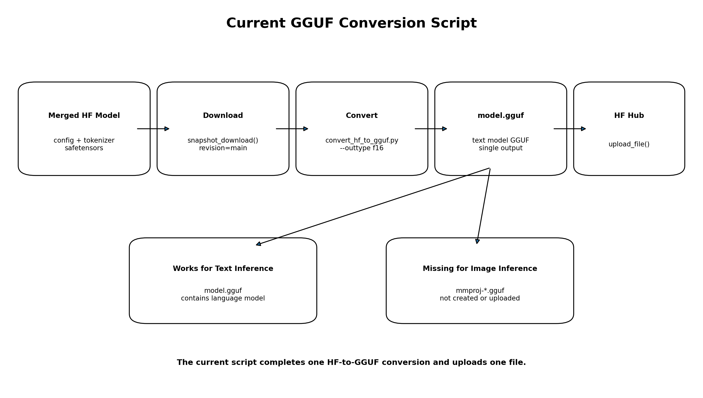
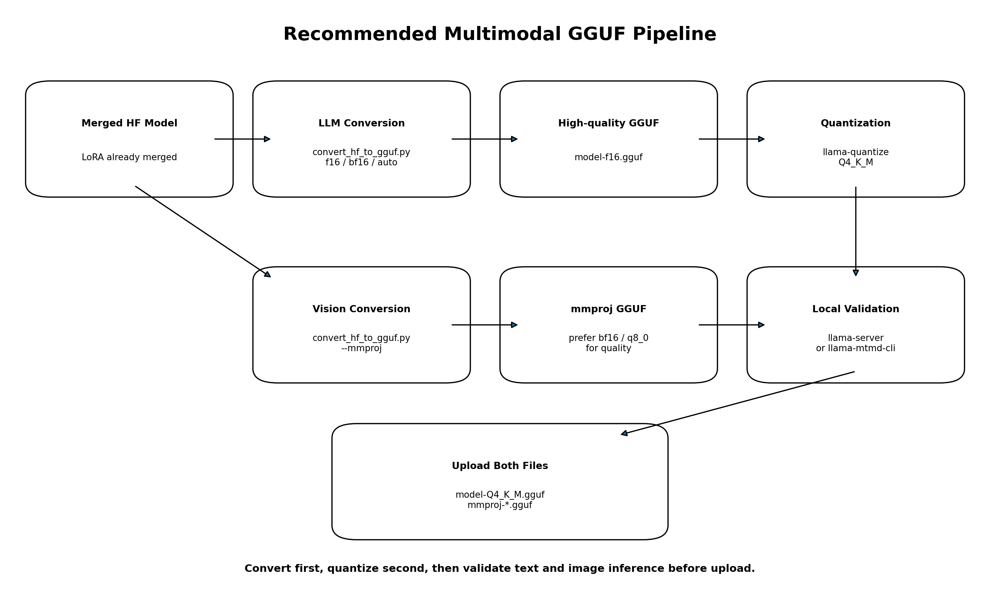
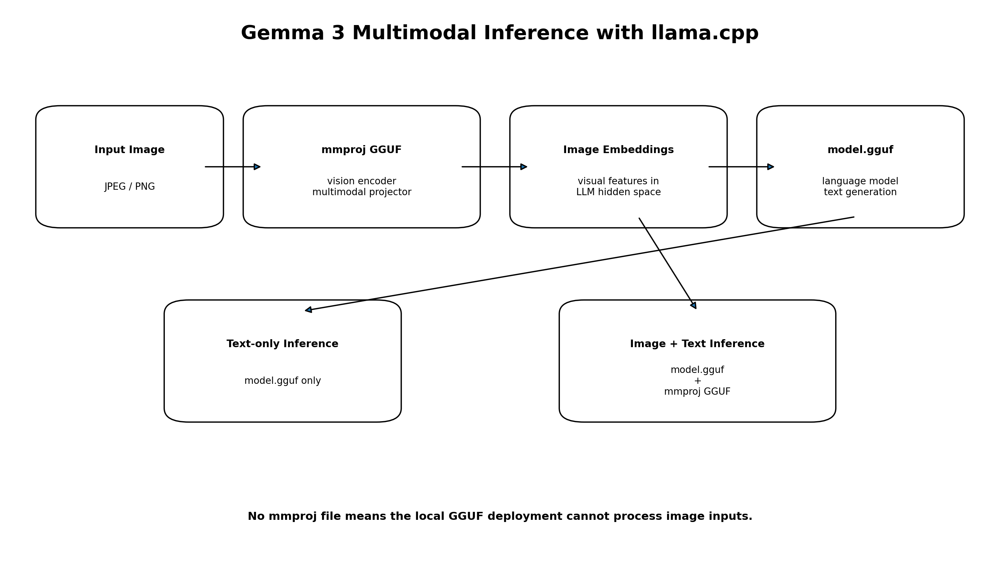

# Gemma 3 멀티모달 모델 GGUF 변환·업로드

`04. GGUF 모델 변환.py`는 Hugging Face Hub에 저장된 **LoRA 병합 완료 Gemma 3 모델**을 로컬에 다운로드하고, `llama.cpp`의 `convert_hf_to_gguf.py`를 실행해 GGUF 형식으로 변환한 뒤 결과 파일을 다시 Hugging Face Hub에 업로드하는 자동화 스크립트입니다.

현재 코드는 다음 단일 파이프라인을 수행합니다.

```text
Hugging Face 병합 모델
    ↓
snapshot_download()
    ↓
로컬 Hugging Face 모델 폴더
    ↓
convert_hf_to_gguf.py
    ↓
model.gguf
    ↓
Hugging Face GGUF 저장소
```



> [!IMPORTANT]
> 현재 코드는 `model.gguf` 하나만 생성합니다. Gemma 3의 **이미지+텍스트 추론**을 `llama.cpp`에서 실행하려면 언어 모델 GGUF와 별도로 **멀티모달 Encoder·Projector가 들어 있는 `mmproj` GGUF**가 필요합니다.

---

## 1. 주요 기능

- `.env`에서 GGUF 변환 설정 로드
- Hugging Face 로그인
- Hub의 병합 모델 전체 다운로드
- `llama.cpp/convert_hf_to_gguf.py` 실행
- F16 등 지정한 타입의 GGUF 생성
- 업로드 대상 Hugging Face 저장소 자동 생성
- 생성된 GGUF 파일 업로드
- 단계별 다운로드·변환·업로드 오류 처리

---

## 2. 실행 방법

```bash
python "04. GGUF 모델 변환.py"
```

원본 파일명이 별표를 포함한다면 다음처럼 실행합니다.

```bash
python "★04. GGUF 모델 변환.py"
```

---

## 3. GGUF란?

GGUF는 `llama.cpp` 계열 실행기에서 모델을 빠르게 로드하고 추론하기 위한 바이너리 모델 형식입니다.

Hugging Face 모델은 보통 여러 파일로 구성됩니다.

```text
config.json
tokenizer.json
tokenizer.model
model-00001-of-0000N.safetensors
model.safetensors.index.json
processor_config.json
preprocessor_config.json
```

GGUF로 변환하면 모델 구조, 가중치, Tokenizer 관련 메타데이터 등이 `.gguf` 파일에 저장됩니다.

```text
model-f16.gguf
model-Q4_K_M.gguf
mmproj-model-q8_0.gguf
```

GGUF의 주요 사용 목적은 다음과 같습니다.

```text
CPU 또는 GPU 로컬 추론
llama.cpp 서버 실행
저정밀도 양자화를 통한 파일 크기 감소
Ollama 등 GGUF 기반 도구 연동
```

---

## 4. 필요한 구성 요소

### Python 패키지

```bash
pip install python-dotenv huggingface_hub
```

`llama.cpp` 변환 스크립트의 Python 의존성도 설치해야 합니다.

```bash
pip install -r llama.cpp/requirements.txt
```

### llama.cpp 설치

```bash
git clone https://github.com/ggml-org/llama.cpp.git
```

Q4_K_M 등의 양자화까지 수행하려면 `llama.cpp` 바이너리를 빌드해야 합니다.

Linux 예:

```bash
cmake -B llama.cpp/build -S llama.cpp
cmake --build llama.cpp/build --config Release -j
```

---

## 5. 환경 변수 설정

스크립트와 같은 디렉터리의 `.env` 파일에 다음 값을 설정합니다.

```env
HF_TOKEN=hf_xxxxxxxxxxxxxxxxx

GGUF_SOURCE_REPO=hyokwan/modal_merge_test

GGUF_LOCAL_DIR=

GGUF_OUTFILE=model-f16.gguf

GGUF_OUTTYPE=f16

GGUF_HF_REPO=hyokwan/modal_merge_test-GGUF

GGUF_LLAMACPP_DIR=./llama.cpp
```

| 환경 변수 | 설명 |
|---|---|
| `HF_TOKEN` | Hugging Face 인증 토큰 |
| `GGUF_SOURCE_REPO` | 변환할 병합 모델 저장소 |
| `GGUF_LOCAL_DIR` | 모델을 내려받을 로컬 폴더 |
| `GGUF_OUTFILE` | 생성할 언어 모델 GGUF 파일명 |
| `GGUF_OUTTYPE` | `f16`, `bf16`, `q8_0`, `auto` 등의 출력 타입 |
| `GGUF_HF_REPO` | GGUF 파일을 업로드할 Hub 저장소 |
| `GGUF_LLAMACPP_DIR` | `llama.cpp` 소스 경로 |

---

## 6. 전체 코드 실행 흐름

```text
loadConfig()
    ↓
hfLogin()
    ↓
downloadModel()
    ↓
convertToGguf()
    ↓
uploadGguf()
```

각 단계가 실패하면 이후 단계는 실행하지 않고 `main()`이 종료됩니다.

---

## 7. 설정 로드: `loadConfig()`

```python
def loadConfig():
    scriptDir = os.path.dirname(
        os.path.abspath(__file__)
    )

    load_dotenv(
        os.path.join(scriptDir, ".env"),
        override=True
    )
```

스크립트와 같은 디렉터리에 있는 `.env` 파일을 읽습니다.

설정값:

```python
cfg = {
    "hf_token": os.getenv("HF_TOKEN", ""),
    "source_repo": os.getenv(
        "GGUF_SOURCE_REPO",
        "hyokwan/modal_merge_test"
    ),
    "local_dir": ggufLocalDir,
    "outfile": os.getenv(
        "GGUF_OUTFILE",
        "model.gguf"
    ),
    "outtype": os.getenv(
        "GGUF_OUTTYPE",
        "f16"
    ),
    "hf_repo": os.getenv(
        "GGUF_HF_REPO",
        ""
    ),
    "llamacpp_dir": os.getenv(
        "GGUF_LLAMACPP_DIR",
        "./llama.cpp"
    ),
}
```

---

## 8. 다운로드 폴더 자동 생성

`GGUF_LOCAL_DIR`이 비어 있으면 다음 형식의 폴더명을 자동 생성합니다.

```python
today = datetime.now().strftime("%Y%m%d")
modelName = cfg["source_repo"].split("/")[-1]

cfg["local_dir"] = (
    f"gguf_{modelName}_{today}"
)
```

예:

```text
GGUF_SOURCE_REPO:
hyokwan/modal_merge_test

실행 날짜:
2026-07-23
```

생성되는 폴더:

```text
gguf_modal_merge_test_20260723
```

현재 날짜까지만 포함하므로 같은 날 여러 번 실행하면 동일한 폴더를 재사용합니다.

충돌을 줄이려면 시각까지 포함할 수 있습니다.

```python
timestamp = datetime.now().strftime(
    "%Y%m%d_%H%M%S"
)
```

---

## 9. Hugging Face 로그인: `hfLogin()`

```python
def hfLogin(hfToken):
    if hfToken and hfToken not in (
        "YOUR_HF_TOKEN",
        ""
    ):
        login(hfToken)
```

유효한 토큰이 있으면 Hugging Face에 로그인합니다.

토큰이 없거나 로그인에 실패하면 다음 작업이 제한될 수 있습니다.

```text
비공개 소스 모델 다운로드
비공개 저장소 조회
GGUF 저장소 생성
GGUF 파일 업로드
```

로그인 실패 시 경고만 출력하고 프로그램은 계속 진행합니다. 따라서 실제 오류는 다운로드 또는 업로드 단계에서 다시 발생할 수 있습니다.

---

## 10. 병합 모델 다운로드: `downloadModel()`

```python
snapshot_download(
    repo_id=cfg["source_repo"],
    local_dir=cfg["local_dir"],
    revision="main",
    max_workers=4,
    token=tokenVal,
)
```

Hugging Face 저장소의 모델 파일 전체를 로컬 폴더로 다운로드합니다.

### 주요 인자

| 인자 | 설명 |
|---|---|
| `repo_id` | 다운로드할 Hugging Face 모델 저장소 |
| `local_dir` | 로컬 저장 경로 |
| `revision="main"` | `main` 브랜치 다운로드 |
| `max_workers=4` | 최대 4개의 병렬 다운로드 |
| `token` | 비공개 저장소 인증 |

예상 다운로드 구조:

```text
gguf_modal_merge_test_20260723/
├── config.json
├── generation_config.json
├── tokenizer.json
├── tokenizer.model
├── tokenizer_config.json
├── processor_config.json
├── preprocessor_config.json
├── chat_template.json
├── model-00001-of-0000N.safetensors
├── model-00002-of-0000N.safetensors
└── model.safetensors.index.json
```

> [!NOTE]
> `revision="main"`은 실행 시점의 최신 `main`을 가져옵니다. 변환 결과 재현성이 중요하다면 특정 커밋 해시나 태그를 환경 변수로 관리하는 것이 좋습니다.

---

## 11. GGUF 변환: `convertToGguf()`

코드가 변환 스크립트 경로를 계산합니다.

```python
scriptDir = os.path.dirname(
    os.path.abspath(__file__)
)

llamacppDir = os.path.join(
    scriptDir,
    cfg["llamacpp_dir"].lstrip("./")
)

convertScript = os.path.join(
    llamacppDir,
    "convert_hf_to_gguf.py"
)
```

다음 파일과 폴더가 실제로 존재하는지 검사합니다.

```text
llama.cpp/convert_hf_to_gguf.py
다운로드한 Hugging Face 모델 폴더
```

---

## 12. 실제 변환 명령

```python
cmd = [
    sys.executable,
    convertScript,
    localDirAbs,
    "--outfile",
    outfileAbs,
    "--outtype",
    cfg["outtype"],
]
```

예를 들어 다음 설정이라면:

```env
GGUF_LOCAL_DIR=gguf_modal_merge_test_20260723
GGUF_OUTFILE=model-f16.gguf
GGUF_OUTTYPE=f16
```

실행 명령은 개념적으로 다음과 같습니다.

```bash
python llama.cpp/convert_hf_to_gguf.py \
  gguf_modal_merge_test_20260723 \
  --outfile model-f16.gguf \
  --outtype f16
```

---

## 13. `sys.executable`을 사용하는 이유

```python
sys.executable
```

은 현재 스크립트를 실행 중인 Python 인터프리터의 절대 경로입니다.

예:

```text
/home/user/project/.venv/bin/python
```

따라서 `convert_hf_to_gguf.py`도 현재 활성화된 가상환경의 Python과 패키지를 사용합니다.

---

## 14. `subprocess.run()`

```python
subprocess.run(
    cmd,
    check=True,
    cwd=scriptDir
)
```

외부 변환 스크립트를 별도 프로세스로 실행합니다.

### `check=True`

변환 프로그램이 0이 아닌 종료 코드를 반환하면 `CalledProcessError`를 발생시킵니다.

주요 실패 원인:

```text
llama.cpp 버전이 Gemma 3 구조를 지원하지 않음
Tokenizer 또는 config 파일 누락
잘못된 outtype
메모리 부족
출력 디렉터리 미존재
잘못된 모델 경로
```

### `cwd=scriptDir`

변환 프로세스의 현재 작업 폴더를 Python 스크립트가 있는 디렉터리로 설정합니다.

---

## 15. 출력 타입 `f16`

기본값:

```python
"outtype": "f16"
```

`f16`은 모델 가중치를 주로 16비트 부동소수점으로 저장합니다.

```text
Hugging Face safetensors
    ↓
F16 GGUF
```

이는 일반적인 의미의 4비트 양자화가 아닙니다.

```text
F16
→ 비교적 높은 정밀도
→ 전체 모델 파일 크기가 큼

Q4_K_M
→ 약 4비트 중심의 혼합 양자화
→ 파일 크기와 메모리 사용 감소
→ 일부 품질 손실 가능
```

현재 `convert_hf_to_gguf.py`에서 직접 지원하는 대표적인 `outtype`은 `f32`, `f16`, `bf16`, `q8_0`, `tq1_0`, `tq2_0`, `auto`입니다. 설치한 `llama.cpp` 버전에 따라 지원 목록이 달라질 수 있으므로 다음 명령으로 확인하는 것이 가장 정확합니다.

```bash
python llama.cpp/convert_hf_to_gguf.py --help
```

---

## 16. Q4_K_M은 별도 양자화 단계

현재 코드의 `--outtype`에 `q4_k_m`을 그대로 전달하는 방식은 권장되는 일반 절차가 아닙니다.

공식적인 기본 흐름은 다음 두 단계입니다.

```text
1. Hugging Face 모델을 고정밀 GGUF로 변환
2. llama-quantize로 Q4_K_M 양자화
```



### 1단계: F16 또는 BF16 GGUF 생성

```bash
python llama.cpp/convert_hf_to_gguf.py \
  ./merged-model \
  --outfile model-f16.gguf \
  --outtype f16
```

### 2단계: Q4_K_M 양자화

```bash
./llama.cpp/build/bin/llama-quantize \
  model-f16.gguf \
  model-Q4_K_M.gguf \
  Q4_K_M
```

양자화는 파일 크기와 메모리를 줄일 수 있지만 정확도 손실이 발생할 수 있습니다.

---

## 17. 왜 이미지 추론에 `mmproj`가 필요한가?

Gemma 3 이미지 추론에서는 언어 모델만으로 이미지를 처리할 수 없습니다.



이미지 입력 처리 흐름:

```text
입력 이미지
    ↓
Vision Encoder
    ↓
이미지 특징
    ↓
Multimodal Projector
    ↓
언어 모델 hidden dimension의 이미지 임베딩
    ↓
Gemma 언어 모델
    ↓
텍스트 답변 생성
```

`llama.cpp` 로컬 멀티모달 실행에서는 이 구조가 일반적으로 두 파일로 분리됩니다.

```text
model.gguf
→ 언어 모델
→ 텍스트 이해와 답변 생성

mmproj-*.gguf
→ Vision Encoder와 멀티모달 Projector
→ 이미지를 언어 모델용 임베딩으로 변환
```

따라서 다음과 같이 구분됩니다.

```text
텍스트 전용 추론:
model.gguf

이미지+텍스트 추론:
model.gguf + mmproj-*.gguf
```

---

## 18. 현재 코드의 핵심 누락

현재 `convertToGguf()`는 변환 명령을 한 번만 실행합니다.

```python
cmd = [
    sys.executable,
    convertScript,
    localDirAbs,
    "--outfile",
    outfileAbs,
    "--outtype",
    cfg["outtype"],
]
```

결과:

```text
model.gguf
```

현재 코드에서 생성하지 않는 파일:

```text
mmproj-model.gguf
```

따라서 현재 코드의 출력만으로는 `llama.cpp`에서 이미지 입력을 처리할 수 없습니다.

---

## 19. `mmproj` 생성 명령

현재 `llama.cpp`의 `convert_hf_to_gguf.py`는 지원되는 Vision 모델에 대해 `--mmproj` 옵션을 제공합니다.

```bash
python llama.cpp/convert_hf_to_gguf.py \
  ./merged-model \
  --outfile model-f16.gguf \
  --outtype q8_0 \
  --mmproj
```

변환 스크립트는 출력 파일명에 `mmproj-` 접두사를 추가합니다.

예상 결과:

```text
mmproj-model-f16.gguf
```

또는 명시한 타입과 버전에 따라:

```text
mmproj-model-q8_0.gguf
```

멀티모달 구성 요소는 품질 저하를 줄이기 위해 BF16, F16 또는 Q8_0처럼 비교적 높은 정밀도로 유지하는 경우가 많습니다.

---

## 20. LoRA 학습 모델과 `mmproj`의 관계

이 프로젝트의 이전 파인튜닝 코드에는 다음 설정이 있었습니다.

```python
target_modules="all-linear"
```

이 설정은 다음 영역의 `Linear` 레이어에 LoRA를 적용합니다.

```text
Gemma Language Model 내부 Linear
Vision Encoder 내부 Attention·MLP Linear
```

반면 Gemma 3 Multimodal Projector의 핵심 가중치가 `nn.Linear`가 아니라 별도 `nn.Parameter`로 구현된 버전에서는 `all-linear`만으로 LoRA가 적용되지 않을 수 있습니다.

그러나 Projector 자체에 LoRA가 적용되지 않았더라도 이미지 추론에는 Vision Encoder와 Projector가 반드시 필요합니다.

```text
Projector가 LoRA 학습 대상이 아님
≠
Projector가 추론에 불필요함
```

따라서 `mmproj`는 반드시 생성해야 합니다.

또한 Vision Encoder 내부 Linear에 반영된 LoRA 학습 결과를 포함하려면 다음 소스에서 `mmproj`를 생성해야 합니다.

```text
원본 Gemma 3 베이스 모델
아님

LoRA merge_and_unload()가 끝난
병합 Hugging Face 모델
```

---

## 21. 시각 학습 결과 보존 검증 필요

`llama.cpp`의 `--mmproj` 변환은 일부 Vision 모델에서만 동작하며, 버전에 따라 멀티모달 변환 방식이 변경될 수 있습니다.

또한 LoRA로 Vision Encoder를 학습한 병합 모델을 GGUF로 변환했을 때 시각 학습 결과가 완전히 보존되지 않았다는 미확인 이슈 보고도 있었습니다.

따라서 다음 두 결과를 반드시 비교하는 것이 좋습니다.

```text
Hugging Face 병합 모델 이미지 추론 결과
vs.
GGUF model + mmproj 이미지 추론 결과
```

동일 이미지와 동일 질문을 사용해 동작명 분류 결과가 일치하는지 확인해야 합니다.

---

## 22. 멀티모달 로컬 실행

### 로컬 파일 직접 지정

```bash
llama-server \
  -m model-Q4_K_M.gguf \
  --mmproj mmproj-model-q8_0.gguf
```

또는 테스트용 CLI:

```bash
llama-mtmd-cli \
  -m model-Q4_K_M.gguf \
  --mmproj mmproj-model-q8_0.gguf \
  --image test.jpg
```

### Hugging Face 저장소 직접 지정

저장소에 올바른 언어 모델 GGUF와 `mmproj`가 함께 구성되어 있다면:

```bash
llama-server \
  -hf YOUR_HF_ID/YOUR_GGUF_REPO
```

최신 `llama.cpp`는 저장소의 멀티모달 Projector를 자동으로 찾을 수 있습니다. 명시적으로 지정해야 하는 환경에서는 `--mmproj`를 사용합니다.

---

## 23. GGUF 업로드: `uploadGguf()`

업로드 저장소가 설정되었는지 검사합니다.

```python
if not cfg["hf_repo"]:
    raise ValueError(
        "GGUF_HF_REPO가 .env에 설정되지 않았습니다."
    )
```

변환된 GGUF 파일 존재 여부도 확인합니다.

```python
if not os.path.exists(outfilePath):
    raise FileNotFoundError(
        f"GGUF 파일 없음: {outfilePath}"
    )
```

---

## 24. Hugging Face 저장소 자동 생성

```python
try:
    api.repo_info(
        repo_id=cfg["hf_repo"],
        repo_type="model",
        token=tokenVal
    )
except Exception:
    api.create_repo(
        repo_id=cfg["hf_repo"],
        repo_type="model",
        token=tokenVal
    )
```

저장소 조회에 실패하면 새 저장소를 생성합니다.

주의할 점은 모든 예외를 “저장소가 없음”으로 간주한다는 것입니다.

다음 오류에서도 `create_repo()`가 호출될 수 있습니다.

```text
네트워크 오류
토큰 권한 오류
접근할 수 없는 비공개 저장소
Hugging Face 서비스 오류
```

가능하면 저장소 미존재 예외와 인증·네트워크 오류를 구분하는 것이 좋습니다.

---

## 25. 파일 업로드

```python
api.upload_file(
    path_or_fileobj=outfilePath,
    path_in_repo=cfg["outfile"],
    repo_id=cfg["hf_repo"],
    repo_type="model",
    token=tokenVal,
)
```

현재 코드는 하나의 파일만 업로드합니다.

```text
model-f16.gguf
```

멀티모달 배포를 위해서는 최소 다음 두 파일을 업로드해야 합니다.

```text
model-Q4_K_M.gguf
mmproj-model-q8_0.gguf
```

선택적으로 고정밀 원본도 함께 보관할 수 있습니다.

```text
model-f16.gguf
model-Q4_K_M.gguf
mmproj-model-q8_0.gguf
README.md
```

---

## 26. 권장 Hugging Face 저장소 구조

```text
YOUR_HF_ID/YOUR_GGUF_REPO
├── README.md
├── model-f16.gguf
├── model-Q4_K_M.gguf
└── mmproj-model-q8_0.gguf
```

README에는 다음 정보를 기록하는 것이 좋습니다.

```text
원본 Hugging Face 모델
베이스 모델
LoRA 학습 설정
GGUF 변환에 사용한 llama.cpp commit
언어 모델 quantization
mmproj precision
텍스트 추론 명령
이미지 추론 명령
알려진 제한 사항
```

---

## 27. 현재 경로 처리의 문제

현재 코드:

```python
cfg["llamacpp_dir"].lstrip("./")
```

`lstrip("./")`은 정확히 `"./"`만 제거하는 것이 아니라 문자열 앞의 모든 `.`와 `/` 문자를 제거합니다.

예:

```text
./llama.cpp
→ llama.cpp
```

이는 의도대로 보이지만:

```text
../llama.cpp
→ llama.cpp
```

처럼 상위 디렉터리 정보까지 사라질 수 있습니다.

권장 방식:

```python
from pathlib import Path

scriptDir = Path(__file__).resolve().parent

llamacppDir = (
    scriptDir / cfg["llamacpp_dir"]
).resolve()
```

---

## 28. 출력 디렉터리 생성 필요

현재 코드:

```python
outfileAbs = os.path.join(
    scriptDir,
    cfg["outfile"]
)
```

예를 들어:

```env
GGUF_OUTFILE=output/model-f16.gguf
```

라고 설정했지만 `output` 폴더가 없다면 변환이 실패할 수 있습니다.

권장 코드:

```python
os.makedirs(
    os.path.dirname(outfileAbs),
    exist_ok=True
)
```

단, `os.path.dirname(outfileAbs)`가 빈 문자열이 아닌지 확인하는 편이 안전합니다.

---

## 29. 로컬 파일 정리 정책

현재 코드는 변환과 업로드가 끝나도 다음 파일을 삭제하지 않습니다.

```text
다운로드한 Hugging Face 모델 폴더
고정밀 model-f16.gguf
양자화 GGUF
mmproj GGUF
```

Gemma 3 4B도 여러 GB의 공간을 사용할 수 있으므로 실행이 반복되면 디스크 사용량이 증가합니다.

권장 정책:

```text
업로드 전에는 로컬 파일 유지
    ↓
텍스트 추론 검증
    ↓
이미지 추론 검증
    ↓
Hub 업로드
    ↓
Hub 재다운로드 검증
    ↓
모든 검증 성공 후 선택적으로 중간 파일 삭제
```

---

## 30. 현재 코드에는 추론 검증이 없음

현재 파이프라인:

```text
다운로드
→ 변환
→ 업로드
→ 완료
```

검증하지 않는 항목:

```text
GGUF가 llama.cpp에서 실제로 로드되는가?
텍스트 답변이 정상 생성되는가?
mmproj가 이미지 입력을 처리하는가?
Vision LoRA 학습 결과가 보존되었는가?
```

따라서 업로드 전에 다음 검증 단계를 추가하는 것이 좋습니다.

### 텍스트 추론

```bash
llama-cli \
  -m model-Q4_K_M.gguf \
  -p "기준금리를 쉽게 설명하시오."
```

### 이미지 추론

```bash
llama-mtmd-cli \
  -m model-Q4_K_M.gguf \
  --mmproj mmproj-model-q8_0.gguf \
  --image test.jpg \
  -p "이 이미지의 필라테스 동작명을 설명하시오."
```

---

## 31. 권장 멀티모달 변환 함수 구조

현재 `convertToGguf()` 대신 다음과 같이 두 번 변환하는 구조가 필요합니다.

```python
def convertToGguf(cfg):
    scriptDir = os.path.dirname(
        os.path.abspath(__file__)
    )

    convertScript = os.path.join(
        scriptDir,
        cfg["llamacpp_dir"],
        "convert_hf_to_gguf.py"
    )

    localDirAbs = os.path.abspath(
        os.path.join(
            scriptDir,
            cfg["local_dir"]
        )
    )

    modelOut = os.path.join(
        scriptDir,
        cfg["outfile"]
    )

    mmprojOut = os.path.join(
        scriptDir,
        cfg["mmproj_outfile"]
    )

    # 언어 모델 GGUF
    modelCmd = [
        sys.executable,
        convertScript,
        localDirAbs,
        "--outfile",
        modelOut,
        "--outtype",
        cfg["outtype"],
    ]

    subprocess.run(
        modelCmd,
        check=True,
        cwd=scriptDir
    )

    # Vision Encoder + Projector GGUF
    mmprojCmd = [
        sys.executable,
        convertScript,
        localDirAbs,
        "--outfile",
        mmprojOut,
        "--outtype",
        cfg["mmproj_outtype"],
        "--mmproj",
    ]

    subprocess.run(
        mmprojCmd,
        check=True,
        cwd=scriptDir
    )
```

> [!NOTE]
> 현재 `convert_hf_to_gguf.py`는 `--mmproj` 사용 시 출력 이름에 `mmproj-` 접두사를 자동으로 추가합니다. 파일명 처리 방식은 설치한 `llama.cpp` 버전의 `--help` 출력으로 확인해야 합니다.

---

## 32. 추가 환경 변수 권장

```env
GGUF_OUTFILE=model-f16.gguf
GGUF_OUTTYPE=f16

GGUF_MM_PROJ_OUTFILE=model-q8_0.gguf
GGUF_MM_PROJ_OUTTYPE=q8_0

GGUF_QUANT_OUTFILE=model-Q4_K_M.gguf
GGUF_QUANT_TYPE=Q4_K_M

GGUF_TEST_IMAGE_PATH=./test/hundred.jpg
GGUF_CLEANUP=false
```

---

## 33. 권장 최종 파이프라인

```text
1. LoRA 병합 완료 HF 모델 다운로드
2. 병합 모델 config·Tokenizer·Processor 확인
3. 언어 모델 F16/BF16 GGUF 생성
4. 동일한 병합 모델에서 mmproj GGUF 생성
5. 언어 모델을 Q4_K_M으로 양자화
6. 로컬 텍스트 추론
7. 로컬 이미지+텍스트 추론
8. Hugging Face 병합 모델 결과와 비교
9. 언어 모델 GGUF와 mmproj 모두 Hub 업로드
10. Hub 파일 재다운로드
11. 최종 텍스트·이미지 추론 검증
12. 선택적으로 중간 로컬 파일 삭제
```

---

## 34. 현재 코드의 장점

- Hugging Face 다운로드·변환·업로드 자동화
- `.env` 기반 설정 분리
- 현재 Python 가상환경을 사용하는 `sys.executable`
- 변환 스크립트와 입력 폴더 사전 검사
- 외부 프로세스 종료 코드 검사
- 업로드 저장소 자동 생성
- 단계별 예외 처리와 명확한 중단 구조
- 웹 애플리케이션에서 호출하기 쉬운 함수 분리

---

## 35. 주요 개선 필요 사항

| 우선순위 | 개선 항목 | 이유 |
|---:|---|---|
| 1 | `--mmproj` 변환 추가 | 이미지 추론에 필수 |
| 2 | mmproj 파일 업로드 추가 | Hub에서 멀티모달 실행 |
| 3 | 로컬 이미지 추론 검증 | 변환 성공만으로 성능 보장 불가 |
| 4 | Q4_K_M 양자화 단계 추가 | F16 파일 크기 감소 |
| 5 | 경로 처리에 `Path.resolve()` 사용 | `lstrip("./")` 오류 방지 |
| 6 | 출력 폴더 자동 생성 | 중첩 출력 경로 지원 |
| 7 | 특정 HF revision 고정 | 변환 재현성 향상 |
| 8 | Hub 오류 종류 구분 | 인증·네트워크 오류 오판 방지 |
| 9 | 로컬 정리 정책 추가 | 디스크 사용량 관리 |
| 10 | llama.cpp commit 기록 | 버전별 변환 차이 추적 |

---

## 36. 핵심 요약

현재 코드가 수행하는 작업:

```text
병합된 Hugging Face 모델
    ↓
snapshot_download()
    ↓
로컬 HF 모델 폴더
    ↓
convert_hf_to_gguf.py
    ↓
model.gguf
    ↓
Hugging Face Hub 업로드
```

텍스트 추론에는 다음 파일이 필요합니다.

```text
model.gguf
```

Gemma 3 이미지+텍스트 추론에는 다음 두 파일이 필요합니다.

```text
model.gguf
+
mmproj-*.gguf
```

Q4_K_M 모델은 일반적으로 다음 두 단계로 만듭니다.

```text
Hugging Face 모델
    ↓
F16/BF16 GGUF 변환
    ↓
llama-quantize
    ↓
Q4_K_M GGUF
```

> **현재 코드는 Hugging Face 병합 모델을 언어 모델용 GGUF 하나로 변환하고 업로드하는 기본 자동화 코드입니다. Gemma 3의 이미지 추론까지 지원하려면 동일한 병합 모델에서 `--mmproj` 파일을 추가 생성하고, 언어 모델 GGUF와 함께 업로드·검증해야 합니다.**

---

## 37. 공식 참고 자료

- llama.cpp 저장소: <https://github.com/ggml-org/llama.cpp>
- Hugging Face 모델 변환 스크립트: <https://github.com/ggml-org/llama.cpp/blob/master/convert_hf_to_gguf.py>
- llama.cpp 멀티모달 실행 문서: <https://github.com/ggml-org/llama.cpp/blob/master/docs/multimodal.md>
- llama.cpp 양자화 문서: <https://github.com/ggml-org/llama.cpp/blob/master/tools/quantize/README.md>
- Vision LoRA 변환 관련 미확인 이슈: <https://github.com/ggml-org/llama.cpp/issues/14867>
